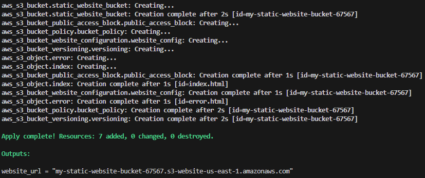

# s3-static-website

## Overview

This project demonstrates how to deploy a static website using AWS S3 and Terraform. The configuration automates the creation of an S3 bucket, enables versioning, sets up a public access policy, and configures the bucket for static website hosting with a custom error page.



## Project Structure

- **Terraform Configuration Files**:
  - `main.tf`: Defines the AWS S3 bucket, website configuration, versioning, and policies.
  - `outputs.tf`: Outputs the website's endpoint.
  - `variables.tf`: Parameterizes the bucket name.
  - `versions.tf`: Specifies the required Terraform and AWS provider versions.
- **Website Files**:
  - `index.html`: The homepage for the static website.
  - `error.html`: Custom error page displayed for any non-existent pages.

## Key Features

- **S3 Static Website Hosting**: The website is served from an S3 bucket with public access enabled.
- **Versioning**: All changes to the website are versioned for better rollback and data retention.
- **Custom Error Page**: A personalized error page for handling 404 errors.
- **Public Access Control**: Bucket policies and access block settings are configured to allow public access to the website's content while keeping the infrastructure simple and manageable.

## How to Deploy

1. **Clone the repository**:

   ```bash
   git clone https://github.com/juan230500/s3-static-website.git
   ```

2. **Navigate to the project directory**:

   ```bash
   cd static-website-s3-terraform/terraform
   ```

3. **Initialize Terraform**:

   ```bash
   terraform init
   ```

4. **Apply the Terraform configuration**:

   ```bash
   terraform apply
   ```

5. **Access the website**: After deployment, the URL of the website will be output, and you can view your static site live.

## Prerequisites

- AWS account with appropriate IAM permissions.
- Terraform installed on your machine.
- Basic knowledge of AWS S3 and Terraform.
